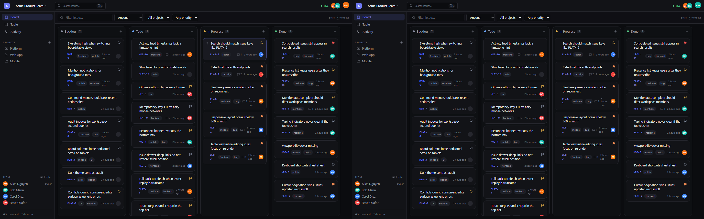

# LiveBoard

Real-time collaborative project workspace — a lightweight Linear × Notion where two (or more) people drag cards, edit issues and comment in the same board and every change lands on everyone's screen instantly.

**Next.js 14 · TypeScript · Socket.IO · Express · MongoDB · Redis pub/sub (optional) · Docker**



*Left window is Alice, right is Bob. The "Rate-limit the auth endpoints" card was dragged into In Progress in Alice's window — it moved live in Bob's. Presence avatars (top right) show who's online.*

## Live demo

**https://liveboard-red.vercel.app** — a frontend-only **demo mode**: the UI runs against an in-browser mock backend with the same seeded Acme data. Pick an identity, drag cards, comment — changes are real to the UI, persist across reloads (localStorage) and sync live across tabs of *the same browser* (open the board in two tabs, side by side). A banner marks demo mode at all times. Cross-browser/multi-user collaboration, presence and typing need the real backend: run it locally with `docker compose up --build` (below).

## What it demonstrates

- **Live multi-client sync over WebSockets** — every mutation appends to a per-workspace event log with a monotonic `seq` and fans out to room-scoped subscribers; other clients apply the event to their cache without refetching.
- **Reconnect resync** — clients keep a per-workspace seq watermark; on reconnect they re-subscribe with `sinceSeq` and receive exactly the missed events as an ordered batch (regression-tested server-side). If the gap exceeds 2000 events the replay truncates and the client falls back to refetching lists.
- **Presence, typing indicators, per-issue viewers** — in-memory registries keyed by socket id (multi-tab safe), membership-checked per workspace.
- **Optimistic UX with conflict handling** — React Query cache patched instantly; every write carries an idempotency key (`clientRequestId`); stale `baseVersion` writes get `409 { current }`; offline writes queue in a persistent outbox and flush idempotently.
- **Workspace isolation & authz** — JWT verified on the Socket.IO handshake *and* membership re-checked on every room join; REST routes check membership on every request; non-members get 403/404 (tested).
- **Cursor pagination everywhere** — keyset cursors (sort field + `_id` tiebreak) for issues list/search/sort, comments, and activity; pages stay stable while rows change underneath (regression-tested).
- **Two-client consistency proof** — a test boots the real HTTP+Socket.IO server against a throwaway Mongo and asserts two concurrent clients converge to byte-identical event streams and final state.

## Product walkthrough

1. Open the app → **identity picker**: pick **Alice Nguyen**, **Bob Marín**, **Carol Diaz** or **Dave Okafor** (no signup needed for the demo).
2. You land in the seeded **Acme Product Team** workspace — Kanban board with 28 realistic issues across Platform / Web App / Mobile projects.
3. **Open the board as a second member:**
   - *Public Vercel demo:* open a second **tab in the same browser** (demo state lives in `localStorage` and syncs via storage events — incognito windows and other browsers have separate storage and will NOT sync).
   - *Real backend (local Docker):* any mix of browsers, windows or machines works — sync happens over Socket.IO.
4. Drag a card in one view → watch it fly in the other. Presence avatars appear top-right; open the same issue in both and you'll see each other's viewer chip and typing dots (presence/typing require the real backend).
5. Comment with `@mentions` — the mentioned user gets a toast. Switch **Table** view for inline editing, **Activity** for the live event feed. `⌘K` opens the command menu, `?` shows shortcuts.

## Architecture

```
┌────────────────────┐   REST (fetch)      ┌──────────────────────┐
│  web/  Next.js 14  │ ──────────────────▶ │ server/  Express     │
│  App Router SPA    │   Socket.IO (WS)    │  REST routes         │
│                    │ ◀────────────────── │  zod validation      │
│  React Query cache │                     ├──────────────────────┤
│  zustand stores    │   'event' pushes    │  Socket.IO gateway   │
│  outbox (offline)  │◀──────────────────  │   jwt handshake      │
└────────────────────┘  per-ws rooms       │   presence/typing    │
                                           │   seq replay         │
        MongoDB ◀──── mongoose ────────────┤  activity log        │
        Redis ◀──── optional adapter ──────┘  (per-ws monotonic)  │
        (multi-instance fanout)                                 │
                                                                │
                              every mutation ──▶ appendEvent() ─┘
                              { id, seq, type, actor, data, ts }
```

Every persisted mutation appends an activity event `{id, seq, type, actor, entityId, data, ts}` — this doubles as the realtime payload, the activity feed, and the reconnect-replay source. Events fan out only inside `ws:<workspaceId>` rooms.

| Concern | Strategy |
| --- | --- |
| Optimistic mutations | Cache patched immediately, rolled back on hard errors; offline writes keep optimistic state in a persisted outbox |
| Duplicate protection | Client-side seen-id LRU on events; server-side idempotency keys replay stored results |
| Conflict strategy | Status/order/metadata = last-write-wins (version bumps); title/description edits send `baseVersion` → `409 { current }` rebase UX |
| Reconnect | Auto-reconnect + `sinceSeq` replay + outbox flush; connection banner mirrors state |
| WS authz | JWT in handshake middleware; membership re-check on every subscribe |
| Pagination | Opaque keyset cursors (field value + `_id` tiebreaker), never offsets |

## Demo data

`npm run seed` (in `server/`) creates the deterministic demo tenant: workspace **Acme Product Team**, users **Alice Nguyen / Bob Marín / Carol Diaz / Dave Okafor** (password `demo1234`, or just use the identity picker), 3 projects, 28 issues across backlog/todo/in-progress/done, and 12 comments with @mention threads plus a full activity feed. It is idempotent — re-running never duplicates.

## Run locally

Docker (whole stack):

```bash
docker compose up --build          # web :3000 · api+ws :4000 · mongo :27017 · redis :6379
# override ports/secret via .env — see .env.example
```

Dev mode:

```bash
# 1. infrastructure
docker compose up -d mongo

# 2. API + WebSocket
cd server && npm install && cp .env.example .env
npm run seed                       # demo workspace + users
npm run dev                        # http://localhost:4000

# 3. web
cd ../web && npm install && cp .env.example .env.local
npm run dev                        # http://localhost:3000
```

Then open http://localhost:3000, pick Alice in one window and Bob in another.

### Two-window E2E check

With the stack running (web on `WEB_URL`), the repo includes the same script used for the screenshots above — it logs in as two identities, drags a card in one window, asserts it appears in the other, checks presence, reload persistence, reconnect-after-offline resync, and live comment sync:

```bash
cd web && npm i -D playwright                 # browsers: set PLAYWRIGHT_BROWSERS_PATH if needed
WEB_URL=http://localhost:3000 node scripts/two-window.mjs
```

## Tests

```bash
npm test            # at repo root — runs the server consistency suite
npm run typecheck   # tsc across server & web
npm run build:web   # next build
```

Actual results on the development machine (Node v24, mongo:7 container):

- `npm test` → **7/7 passing** (`consistency.test.ts`: convergence + byte-equal streams, cursor-pagination continuity under reordering, search+cursor composition, presence removal on unsubscribe, exact reconnect replay window, idempotency, version conflicts, isolation/authz)
- `npm run typecheck` → clean (server + web)
- `npm run build:web` → succeeds, all 8 routes compile
- `WEB_URL=http://localhost:3000 node scripts/two-window.mjs` → **7/7 checks pass** (two-browser realtime suite described above)
- `WEB_URL=<vercel-url> node scripts/demo-check.mjs` → **11/11 checks pass against the deployed demo mode** (picker, 28 seeded cards, demo banner, drag, cross-tab live sync, reload persistence, zero console errors)

The suite prefers `TEST_MONGO_URI` (any throwaway Mongo) and falls back to `mongodb-memory-server`.

## Deployment

Full split-deploy runbook (API on a long-running host, Mongo, web on Vercel): **[docs/DEPLOY.md](docs/DEPLOY.md)**.

Current hosting:

- **Web**: https://liveboard-red.vercel.app (Vercel) — the full multi-user app against the live backend below.
- **Realtime backend (API + Socket.IO)**: https://liveboard-api-obye.onrender.com (Render Web Service).
- **Database**: MongoDB Atlas.

> The public demo backend runs on a free service and may take up to about a minute to wake after inactivity; the frontend shows a brief “waking demo backend…” state and reconnects automatically.

## Known limitations

- **Cold start**: the free realtime backend sleeps when idle and wakes on the next visit (~1 min). This is expected; no manual refresh is needed.
- A frontend-only demo mode (`NEXT_PUBLIC_DEMO=1`) is still available for backend-less hosting; it is a mock (single browser, localStorage) and is not what the public URL runs.
- Presence/typing/viewers are in-memory (per instance); scale beyond one API instance requires the Redis adapter (wired behind `REDIS_URL`, but presence registries themselves aren't shared yet).
- Replay cap of 2000 events falls back to a full refetch rather than partial application.
- No email verification/password reset; demo-grade auth.
- Soft-deleted issues are filtered from all views but not purged or restorable from the UI.
